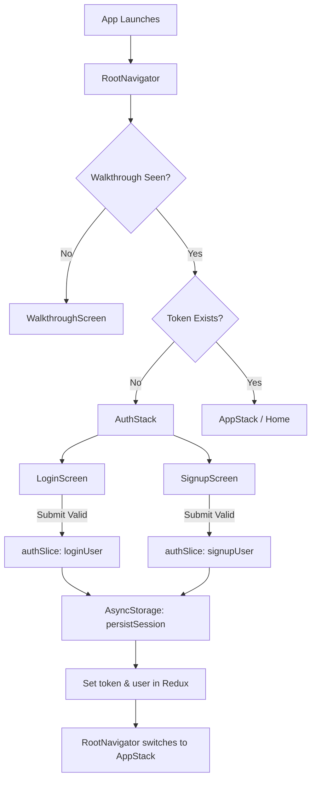

# Authentication (Login & Registration) Documentation

This document explains the architecture, flow, screens, state management, validation, and storage mechanisms for **Login** and **Registration (Signup)** in the Cabora React Native application.

---

## 1. Overview & Architecture

The application uses **Redux Toolkit** combined with **AsyncStorage** for persistent local session management.



---

## 2. Directory Structure

```
src/
├── screen/
│   ├── LoginScreen/
│   │   ├── index.js          # Login UI & form submission logic
│   │   └── style.js          # Styling for Login Screen
│   └── SignupScreen/
│       ├── index.js          # Signup UI & form submission logic
│       └── style.js          # Styling for Signup Screen
├── redux/
│   ├── hooks.js              # Typed / customized Redux hooks (useAppDispatch, useAppSelector)
│   ├── store.js              # Redux store configuration
│   └── slices/
│       └── authSlice.js      # Auth async thunks, reducers & session persistence
├── navigation/
│   ├── RootNavigator.js      # Conditionally renders Walkthrough, AuthStack, or AppStack
│   └── AuthStack.js          # Native stack navigator for Login & Signup
├── utils/
│   └── validators.js         # Email & password validation functions
└── config/
    ├── color.js              # Color palette
    └── setting.js            # Storage keys & demo credentials
```

---

## 3. Login Screen (`src/screen/LoginScreen/index.js`)

### Key Features:
- **Default / Pre-filled Demo Credentials**: Uses `DEMO_CREDENTIALS` (`demo@email.com` / `password`) from [`src/config/setting.js`](file:///d:/projects/cabora_react_native/src/config/setting.js) for easy testing.
- **Form Fields**:
  - `Email` (type: email-address)
  - `Password` (secureTextEntry)
- **Validation**:
  - Validates email format via `isValidEmail`.
  - Validates minimum length (>= 6 characters) via `isValidPassword`.
- **Submission Action**:
  - Dispatches `loginUser({ email, password })`.
  - On failure, displays an `Alert.alert('Login failed', error)`.
- **Navigation**:
  - Includes a link to navigate to the Registration screen (`Signup`).

---

## 4. Registration Screen (`src/screen/SignupScreen/index.js`)

### Key Features:
- **Form Fields**:
  - `Name` (Text input, capitalizes words)
  - `Email` (type: email-address)
  - `Password` (secureTextEntry)
- **Validation**:
  - Checks if `name` is not empty (`Name is required`).
  - Validates email syntax via `isValidEmail`.
  - Validates password length via `isValidPassword` (>= 6 characters).
- **Submission Action**:
  - Dispatches `signupUser({ name, email, password })`.
  - On failure, displays an `Alert.alert('Sign up failed', error)`.
- **Navigation**:
  - Includes a link to return back to `Login`.

---

## 5. State Management & Offline Storage (`src/redux/slices/authSlice.js`)

**No external API is called.** All registration, authentication, and session handling is purely local using **Redux Toolkit** and persistent **AsyncStorage**.

### Initial State:
```javascript
const initialState = {
  user: null,             // Currently logged-in user: { id, name, email }
  token: null,            // Active session token: "local-token-<timestamp>"
  registeredUsers: [],    // Array of registered accounts: [{ id, name, email, password }]
  loading: false,         // Spinner status during sign up / log in
  bootstrapped: false,    // True when stored session & registered users are loaded
  error: null,            // Error message string if failed
};
```

### Flow Breakdown (100% Local / No API):

1. **Registration Flow (`signupUser`)**:
   - Takes `{ name, email, password }`.
   - Checks Redux `state.auth.registeredUsers` to make sure the email is not already registered.
   - Adds the new user record `{ id, name, email, password }` to `registeredUsers`.
   - Persists the updated `registeredUsers` array into `AsyncStorage` (`cabora.auth.registered_users`).
   - Automatically signs the user in by saving the active session token and user profile.

2. **Login Flow (`loginUser`)**:
   - Takes `{ email, password }`.
   - Compares the entered credentials against the local `registeredUsers` array (and default demo credentials).
   - If not found: Returns *"No account found with this email. Please sign up first."*
   - If password incorrect: Returns *"Incorrect password. Please try again."*
   - If valid: Persists active session and logs the user in.

3. **App Startup (`bootstrapAuth`)**:
   - Restores saved `token`, active `user`, and all `registeredUsers` from `AsyncStorage`.

### Storage Keys ([`src/config/setting.js`](file:///d:/projects/cabora_react_native/src/config/setting.js)):
```javascript
export const STORAGE_KEYS = {
  token: 'cabora.auth.token',
  user: 'cabora.auth.user',
  walkthrough: 'cabora.app.walkthrough',
  notifications: 'cabora.app.notifications',
};
```

---

## 6. Input Validation Rules (`src/utils/validators.js`)

```javascript
export function isValidEmail(email) {
  return /^[^\s@]+@[^\s@]+\.[^\s@]+$/.test(String(email).trim());
}

export function isValidPassword(password) {
  return String(password).length >= 6;
}
```

---

## 7. Navigation Flow (`RootNavigator.js`)

The root navigator switches top-level stacks conditionally:

```javascript
{!walkthroughSeen ? (
  <WalkthroughScreen />
) : token ? (
  <AppStack />      // Main app with Tabs & Drawer
) : (
  <AuthStack />     // Login and Signup screens
)}
```

When `loginUser` or `signupUser` succeeds, `state.auth.token` is populated, automatically triggering transition from `AuthStack` to `AppStack`.

---

## 8. Connecting to a Live Backend API (Future Steps)

Currently, auth operations run locally in **Demo Mode**. To connect to a real REST or GraphQL backend:

1. Update `BASE_URL` in [`src/config/setting.js`](file:///d:/projects/cabora_react_native/src/config/setting.js).
2. Modify `loginUser` and `signupUser` thunks in [`src/redux/slices/authSlice.js`](file:///d:/projects/cabora_react_native/src/redux/slices/authSlice.js) to make network requests (e.g. via `fetch` or `axios`):
   ```javascript
   export const loginUser = createAsyncThunk(
     'auth/login',
     async ({email, password}, {rejectWithValue}) => {
       try {
         const response = await fetch(`${BASE_URL}/api/auth/login`, {
           method: 'POST',
           headers: {'Content-Type': 'application/json'},
           body: JSON.stringify({email, password}),
         });
         const data = await response.json();
         if (!response.ok) {
           return rejectWithValue(data.message || 'Login failed');
         }
         return persistSession(data.token, data.user);
       } catch (err) {
         return rejectWithValue(err.message || 'Network error');
       }
     },
   );
   ```
